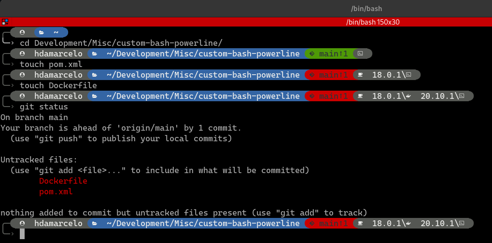
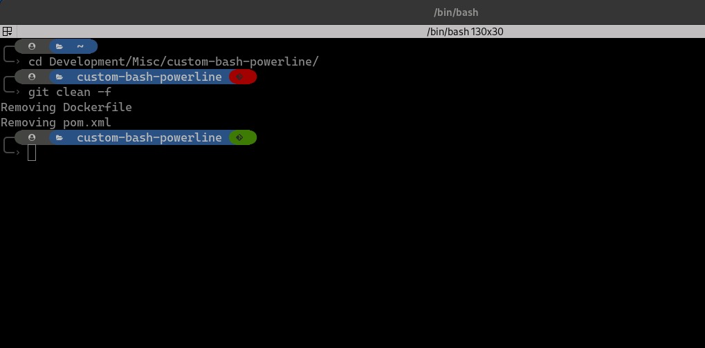

# Custom Bash powerline theme (for Windows via git-bash and Linux)

Simple powerline theme for bash.

Made from scratch to learn how the bash prompt is assembled with ideas from other similar projects.

 



## Install:

You can just download the **theme.bash** file and source it in your **.bashrc** file.

To make it easier clone the repository to a **.folder** in your **HOME** directory:

```bash
cd $HOME
mkdir -p .bash/themes/custom-bash-powerline
git clone https://github.com/hdamarcelo/custom-bash-powerline.git .bash/themes/custom-bash-powerline
```

then add the following to your .bashrc:

```bash
# Custom bash theme
THEME=$HOME/.bash/themes/custom-bash-powerline/theme.bash
if [ -f $THEME ]; then
   source $THEME
fi
unset THEME
```

## Dependencies:

Currently it is not possible to disable the custom segments with developer oriented information (feel free to change this :) ). So you will also need to have these executables in your PATH:

1. * java
   * docker
   * kubectl

2. Depending on the linux distribution or git-bash installation it may be necessary to change the following line in the **theme.bash** file:
```bash
source /usr/share/git-core/contrib/completion/git-prompt.sh
# Change this line if the git-prompt.sh script is in another location
# Using itavoids reinventing the whell on how to get repository information
```

3. You will also need a
[Powerline-patched font](https://github.com/powerline/fonts). Or else the custom characters won't show properly.

## License:

MIT